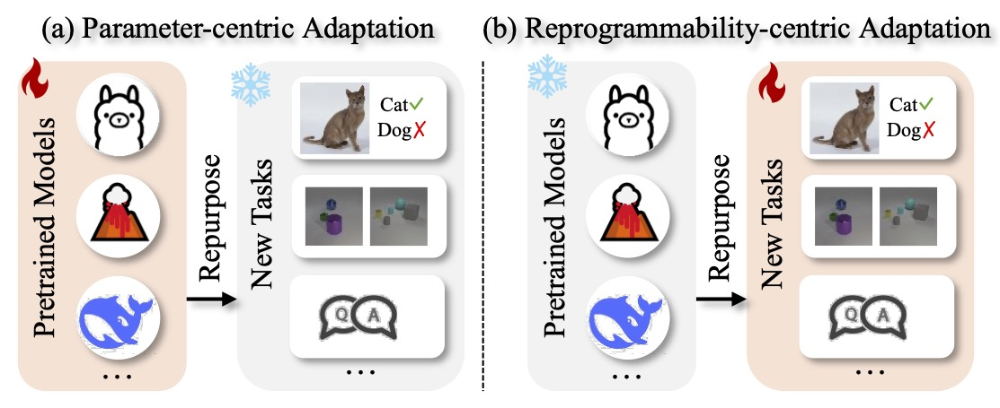

# Awesome Neural Network Reprogrammability [](https://awesome.re)

> **📢 [AAAI 2026 Tutorial Website Now Live!](https://zyecs.github.io/awesome-reprogrammability/tutorial-AAAI26/)** - Learn neural network reprogrammability techniques for parameter-efficient foundation model adaptation.

<div align="center">

> A comprehensive collection of resources on neural network reprogrammability - the art of adapting pre-trained models for new tasks without updating their parameters.

[](https://creativecommons.org/licenses/by/4.0/)
[](CONTRIBUTING.md)
[](README.md)

📚 **[View AAAI 2026 Tutorial Website](https://zyecs.github.io/awesome-reprogrammability/tutorial-AAAI26/)** | [Source](tree/main/tutorial-AAAI26)

</div>

---

## 📖 What is Neural Network Reprogrammability?

**Neural network reprogrammability** is a unified framework for adapting pre-trained models to new tasks without modifying their parameters, through a principle of **interface manipulation** - 
modifying downstream tasks to align with the pre-trained models, rather than changing the models themselves.
This encompasses three popular paradigms:

- 🔧 **Model Reprogramming**: Learning input transformation (e.g., learnable noises) to repurpose frozen models
   - e.g., to reuse an ImageNet-pretrained classifier,
- 🎯 **Prompt Tuning**: Optimizing continuous prompts (e.g., soft token embeddings) to guide model behavior
- 💬 **Prompt Instruction**: Using natural language/visual demonstrations (i.e., fixed ) to elicit in-context learning

<div align="center">

</div>

## 🗂️ Contents

- [🏗️ Overall Framework](#-overall-framework)
- [📚 Resources by Type](#-resources-by-type)
  - [📄 Research Papers](#-research-papers)
  - [🛠️ Tools & Libraries](#-tools--libraries)
  - [📊 Datasets & Benchmarks](#-datasets--benchmarks)
  - [📖 Educational Resources](#-educational-resources)
- [🔬 Explore by Taxonomy](#-explore-by-taxonomy)
- [🚀 Applications & Use Cases](#-applications--use-cases)
- [🤝 Contributing](#-contributing)

---

## 🏗️ Overall Framework

Neural network reprogrammability is a unified way to understand different adaptation paradigms, operating through **four key dimensions** that instantiate and distinguish existing methods.

### 🧮 Formulation

The core principle can be expressed through an **universal formulation**:

$$\hat{\mathbf{y}}^{\rm T} = O_{\omega} \circ f \circ I_{\lambda, \tau, \ell} (\mathbf{x}^{\rm T}, c) $$

Where:
- **$f$**: Pre-trained model (frozen parameters)
- **$\mathbf{x}^{\rm T}$**: Downstream task input (e.g., an image, a text)
- **$\hat{\mathbf{y}}^{\rm T}$**: Predicted output for the downstream task of the corresponding input $\mathbf{x}^{\rm T}$

and
- **$I$**: Input Manipulation function with following optional design choices
   - **$\lambda$**: Manipulation configuration, what manipulation is applied (i.e., learnable or fixed)
   - **$\tau$**: Manipulation operator, how manipulation is applied (i.e., additive, concatenative, parametric)
   - **$\ell$**: Manipulation location, where manipulation is applied (i.e., input space, embedding space, hidden space)
- **$O_\omega$**: Output Alignment function


> **Takeaway**: All three paradigms (Model Reprogramming, Prompt Tuning, Prompt Instruction) are special cases of this unified framework, differing only in their choice of $(\lambda, \ell, \tau, \omega)$.

### 📐 Four-Dimensional Taxonomy

<table>
<tr>
<td><strong>🔧 Configuration (λ)</strong><br><em>Parameter Format</em></td>
<td><strong>📍 Location (ℓ)</strong><br><em>Where Applied</em></td>
<td><strong>⚙️ Operator (τ)</strong><br><em>How Applied</em></td>
<td><strong>🎯 Alignment (ω)</strong><br><em>Task Mapping</em></td>
</tr>
<tr>
<td>
• <strong>Learnable</strong>: Optimized parameters<br>
• <strong>Fixed</strong>: Manual/rule-based<br>
</td>
<td>
• <strong>Input</strong>: Raw input space<br>
• <strong>Embedding</strong>: Token/feature embeddings<br>
• <strong>Hidden</strong>: Intermediate representations<br>
</td>
<td>
• <strong>Additive</strong>: Adding components<br>
• <strong>Concatenative</strong>: Joining elements<br>
• <strong>Parametric</strong>: Learned transformations<br>
</td>
<td>
• <strong>Identity</strong>: Direct mapping<br>
• <strong>Rule-based</strong>: Structured rules
• <strong>Linear</strong>: Linear transformations<br>
• <strong>Statistical</strong>: Counting-based matching<br>
</td>
</tr>
</table>

### 🧩 Method Characteristics

> This only refers to a commonly categorization in the existing papers, but does not *strictly* imply future works.

| Method | Configuration | Typical Location | Common Operators | Alignment |
|--------|---------------|------------------|------------------|-----------|
| **Model Reprogramming** | Learnable | Input, Embedding | Additive, Concatenative, Parametric | Statistical, Linear |
| **Prompt Tuning** | Learnable | Embedding, Hidden | Concatenative | Linear, Identity |
| **Prompt Instruction** | Fixed | Input | Concatenative | Rule-based, Identity |

> 📖 **Learn More**: [Taxonomy Guide](meta/taxonomy.md) • [Complete Survey Paper](https://arxiv.org/html/2506.04650v2)

---

## 📚 Resources by Type

### 📄 Research Papers

#### 🏆 Foundational Papers

- **[Adversarial Reprogramming of Neural Networks](https://arxiv.org/abs/1806.11146)** (Elsayed et al., 2019, ICLR) - Introducing the concept of model reprogramming
- **[The Power of Scale for Parameter-Efficient Prompt Tuning](https://arxiv.org/abs/2104.08691)** (Lester et al., 2021, EMNLP) - Foundational prompt tuning research
- **[Learning to Prompt for Vision-Language Models](https://arxiv.org/abs/2109.01134)** (Zhou et al. 2022, IJCV) - Soft prompting tuning for Vision-Language Models on the textual branch
- **[Language Models are Few-Shot Learners](https://arxiv.org/abs/2005.14165)** (Brown et al., 2020, NeurIPS) - First work that demonstrates that scaling LLMs can elicit in-context learning capability
- **[Chain-of-Thought Prompting Elicits Reasoning in Large Language Models](https://arxiv.org/abs/2201.11903)** (Wei et al., 2022, NeurIPS) - Breakthrough in instruction-based reasoning

<!-- AUTO:START -->


#### 📈 Recent Advances (2024-2026) (auto-generated)

<details>
<summary><strong>Model Reprogramming</strong> <em>(10 papers)</em></summary>

- [Attribute-based Visual Reprogramming for Vision-Language Models](https://arxiv.org/abs/2501.13982) (2025, ICLR)
- [Model Reprogramming Demystified: A Neural Tangent Kernel Perspective](https://arxiv.org/abs/2506.0620) (2025, arXiv)
- [Refine: Inversion-free backdoor defense via model reprogramming](https://arxiv.org/abs/2502.18508) (2025, ICLR)
- [Reprogramming pretrained language models for protein sequence representation learning](https://arxiv.org/abs/2301.02120) (2025, Digital Discovery)
- [Understanding Model Reprogramming for CLIP via Decoupling Visual Prompts](https://arxiv.org/abs/2506.01000) (2025, ICML)
- [AutoVP: An Automated Visual Prompting Framework and Benchmark](https://arxiv.org/abs/2310.08381) (2024, ICLR)
- [Bayesian-guided Label Mapping for Visual Reprogramming](https://arxiv.org/abs/2410.24018) (2024, NeurIPS)
- [Model Reprogramming Outperforms Fine-tuning on Out-of-distribution Data in Text-Image Encoders](https://arxiv.org/abs/2403.10800) (2024, SatML)
- [Sample-specific Masks for Visual Reprogramming-based Prompting](https://arxiv.org/abs/2406.03150) (2024, ICML)
- [Time-LLM: Time Series Forecasting by Reprogramming Large Language Models](https://arxiv.org/abs/2310.01728) (2024, ICLR)

</details>

<details>
<summary><strong>Prompt Tuning</strong> <em>(4 papers)</em></summary>

- [Draw-and-Understand: Leveraging Visual Prompts to Enable MLLMs to Comprehend What You Want](https://arxiv.org/abs/2403.20271) (2025, ICLR)
- [ArGue: Attribute-Guided Prompt Tuning for Vision-Language Models](https://arxiv.org/abs/2311.16494) (2024, CVPR)
- [Exploring the Transferability of Visual Prompting for Multimodal Large Language Models](https://arxiv.org/abs/2404.11207) (2024, CVPR)
- [PromptKD: Unsupervised Prompt Distillation for Vision-Language Models](https://arxiv.org/abs/2403.02781) (2024, CVPR)

</details>

<details>
<summary><strong>Prompt Instruction</strong> <em>(2 papers)</em></summary>

- [Joint Visual and Text Prompting for Improved Object-Centric Perception with Multimodal Large Language Models](https://arxiv.org/abs/2404.04514) (2024, arXiv)
- [PIVOT: Iterative Visual Prompting Elicits Actionable Knowledge for VLMs](https://arxiv.org/abs/2402.07872) (2024, ICML)

</details>

<details>
<summary><strong>Prompt Tuning / Prompt Instruction</strong> <em>(1 papers)</em></summary>

- [When Do Prompting and Prefix-Tuning Work? A Theory of Capabilities and Limitations](https://arxiv.org/pdf/2310.19698) (2024, ICLR)

</details>

> 📋 **Complete List**: [All Papers with Taxonomy Classification](docs/sections/papers.md)

_Last updated: 2026-01-13 14:18 UTC_

<!-- AUTO:END -->

### 🛠️ Tools & Libraries

### 📊 Datasets & Benchmarks

#### 🎯 Few-Shot Learning

- **[MetaDataset](https://github.com/google-research/meta-dataset)** - Meta-learning benchmark
- **[VTAB](https://github.com/google-research/task_adaptation)** - Visual Task Adaptation Benchmark
- **[FewRel](https://github.com/thunlp/FewRel)** - Few-shot relation classification

#### 🔄 Cross-Domain Transfer

- **[DomainNet](http://ai.bu.edu/M3SDA/)** - Multi-source domain adaptation
- **[Office-31](https://faculty.cc.gatech.edu/~judy/domainadapt/)** - Office domain adaptation
- **[VisDA](http://ai.bu.edu/visda-2017/)** - Visual domain adaptation challenge

#### 📝 Text-to-Text

- **[GLUE](https://gluebenchmark.com/)** - General Language Understanding Evaluation
- **[SuperGLUE](https://super.gluebenchmark.com/)** - More challenging language understanding
- **[T5 Evaluation](https://github.com/google-research/text-to-text-transfer-transformer)** - Text-to-text transfer transformer tasks

### 📖 Educational Resources

#### 🎓 Tutorials & Courses
- **[Neural Network Reprogrammability Tutorial](tutorial-AAAI26/)** - AAAI 2026 tutorial materials

#### 📚 Books & Surveys

- **[A Comprehensive Survey of Neural Network Reprogrammability](https://arxiv.org/html/2506.04650v2)** - Definitive survey paper
- **[Pre-train, Prompt, and Predict](https://arxiv.org/abs/2107.13586)** - Natural language processing paradigm

---

## 🔬 Explore by Taxonomy

Navigate resources by the four-dimensional taxonomy:

### 🔧 By Configuration

- **[Learnable Approaches](docs/sections/taxonomy.md#learnable)** - Optimization-based methods
- **[Fixed Approaches](docs/sections/taxonomy.md#fixed)** - Rule-based and manual methods
- **[Hybrid Approaches](docs/sections/taxonomy.md#hybrid)** - Combined strategies

### 📍 By Location

- **[Input Space](docs/sections/taxonomy.md#input)** - Raw input modifications
- **[Embedding Space](docs/sections/taxonomy.md#embedding)** - Token/feature embeddings
- **[Hidden Space](docs/sections/taxonomy.md#hidden)** - Intermediate representations
<!-- - **[Output Space](docs/sections/taxonomy.md#output)** - Final layer adaptations -->

### ⚙️ By Operator

- **[Additive](docs/sections/taxonomy.md#additive)** - Adding new components
- **[Concatenative](docs/sections/taxonomy.md#concatenative)** - Joining elements
- **[Parametric](docs/sections/taxonomy.md#parametric)** - Learned transformations
<!-- - **[Replacement](docs/sections/taxonomy.md#replacement)** - Component substitution -->

### 🎯 By Alignment

- **[Identity Mapping](docs/sections/taxonomy.md#identity)** - Direct output use
- **[Linear Alignment](docs/sections/taxonomy.md#linear)** - Linear transformations
- **[Statistical Alignment](docs/sections/taxonomy.md#statistical)** - Counting-based matching
- **[Rule-based Alignment](docs/sections/taxonomy.md#rule-based)** - Structured mapping

---

## 🚀 Applications & Use Cases

### 🎯 Core Applications


---

## 🎓 Learning Path

### 🌱 Beginner Track

1. **Foundations**
   - Read the [survey paper](https://arxiv.org/html/2506.04650v2)
   - Understand the [four-dimensional taxonomy](meta/taxonomy.md)

---

## 🏆 Featured Projects & Implementations

### 🌟 Flagship Projects

- **[Input Manipulation](https://github.com/tmlr-group/smm)** - Sample-specific visual prompting
- **[Output Alignment](https://github.com/tmlr-group/BayesianLM)** - Statistical gradient-free output mapping
- **[Reprogramming VLM](https://github.com/tmlr-group/attrvr)** - Model Reprogramming with vision-language models
- **[Multiple Prompts](https://github.com/tmlr-group/DecoupledVP)** - When multiple visual prompts are effective
- **[CoOp & CoCoOp](https://github.com/KaiyangZhou/CoOp)** - Learning to prompt for vision-language models
- **[Time-LLM](https://github.com/KimMeen/Time-LLM)** - Time series forecasting by reprogramming LLMs


### 🔥 Recent Breakthroughs

- **AutoVP** - Automated visual prompting framework
- **MaPLe** - Multi-modal prompt learning
- **Set-of-Mark** - Visual grounding with structured prompts

---

## 📊 Quick Stats

<div align="center">

| Category | Count | Latest Addition |
|----------|-------|----------------|
| 📄 **Research Papers** | 69+ | 2025-09 |
| 🛠️ **Tools & Libraries** | x+ | 2025-09 |
| 📊 **Datasets** | x+ | 2025-09 |
| 🎓 **Educational Resources** | 0+ | 2025-09 |

</div>

---

## 🤝 Contributing

We welcome contributions from the community! This awesome list thrives on community input.

### 🎯 What We're Looking For

- **High-quality papers** with novel insights or strong empirical results
- **Well-maintained tools** that are actively developed and documented
- **Comprehensive datasets** that enable fair evaluation
- **Educational content** that helps others learn

<!-- ### 📝 How to Contribute

1. **Fork** this repository
2. **Add** your resource following our [guidelines](CONTRIBUTING.md)
3. **Validate** using our automated tools
4. **Submit** a pull request

### 🔍 Validation Process

Before submitting, please run:
```bash
python scripts/validate_lists.py
python scripts/linkcheck.py
python scripts/render_readme.py
```

> 📖 **Full Guidelines**: [Contributing Guide](CONTRIBUTING.md) -->

---

## 🙏 Acknowledgments

This awesome list is built upon the comprehensive survey ["A Comprehensive Survey of Neural Network Reprogrammability"](https://arxiv.org/html/2506.04650) and the collective work of researchers worldwide advancing the field of neural network reprogrammability.

Special thanks to all [contributors](https://github.com/your-username/awesome-reprogrammability/graphs/contributors) who help maintain and improve this resource.

---

## 📄 License

[](https://creativecommons.org/licenses/by/4.0/)

This work is licensed under a [Creative Commons Attribution 4.0 International License](https://creativecommons.org/licenses/by/4.0/).

---

<div align="center">

**⭐ Star this repository if you find it helpful! ⭐**

[🔝 Back to Top](#awesome-neural-network-reprogrammability-)

</div>